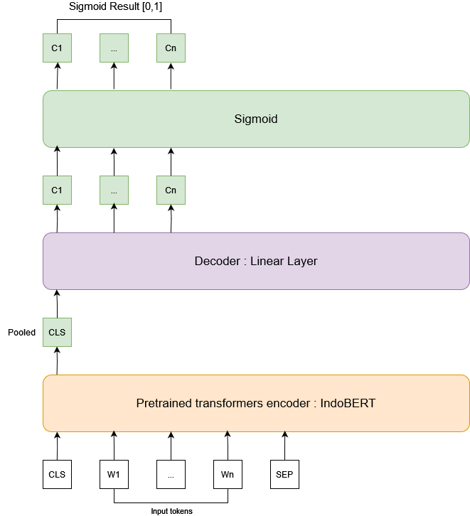
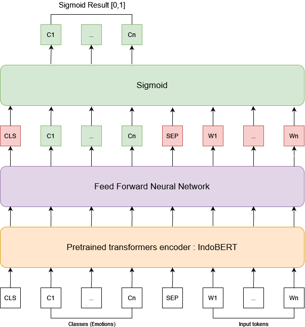

# TA Multi-label Emotion Classification on Indonesian Text
Author : Safiq Faray

Code is modification or taken from these repos :
- https://github.com/hasanhuz/SpanEmo
- https://github.com/Tau-J/MultilabelCrossEntropyLoss-Pytorch

Seperate repo for dataset : https://github.com/Haruray/indonesian-multilabel-emotion-dataset 

## Architecture
IndoBERT : 

SpanEmo :

## Results
### Validation Set

- BCE : Binary cross entropy loss
- LCA : Label correlation aware loss
- ZLPR : Loss Zero Bounded Log-sum-exp & Pairwise Rank-based loss

The number represents the weight of each loss functions for the final loss calculation

| Model    | BCE  | LCA  | ZLPR | F1-Macro | F1-Micro | JS    |
|----------|------|------|------|----------|----------|-------|
| IndoBERT | 0.1  | 0.0  | 0.0  | 0.5601   | 0.6954   | 0.6181|
|          | 0.0  | 1.0  | 0.0  | 0.5865   | 0.6922   | 0.6248|
|          | 0.0  | 0.0  | 1.0  | 0.5492   | 0.6906   | 0.6168|
|          | 0.1  | 0.9  | 0.0  | 0.6044   | 0.7105   | 0.6508|
|          | 0.5  | 0.0  | 0.5  | 0.5737   | 0.7014   | 0.6362|
|          | 0.0  | 0.9  | 0.1  | 0.5700   | 0.7061   | 0.6324|
| SpanEmo  | 1.0  | 0.0  | 0.0  | 0.5849   | 0.7012   | 0.6217|
|          | 0.0  | 1.0  | 0.0  | 0.3496   | 0.6686   | 0.5586|
|          | 0.0  | 0.0  | 1.0  | 0.5374   | 0.6694   | 0.5933|
|          | 0.5  | 0.5  | 0.0  | 0.5680   | 0.6963   | 0.6278|
|          | 0.8  | 0.0  | 0.2  | 0.5894   | 0.7036   | 0.6283|
|          | 0.0  | 0.6  | 0.4  | 0.5976   | 0.7063   | 0.6324|

### Test Set
Each model uses the best loss weights

| Model    | F1-Macro | Precision Macro | Recall Macro | F1-Micro | JS    |
|----------|----------|-----------------|--------------|----------|-------|
| IndoBERT | 0.5864   | 0.5936          | 0.5975       | 0.7040   | 0.6353|
| SpanEmo  | 0.5891   | 0.6422          | 0.5645       | 0.7058   | 0.6269|
